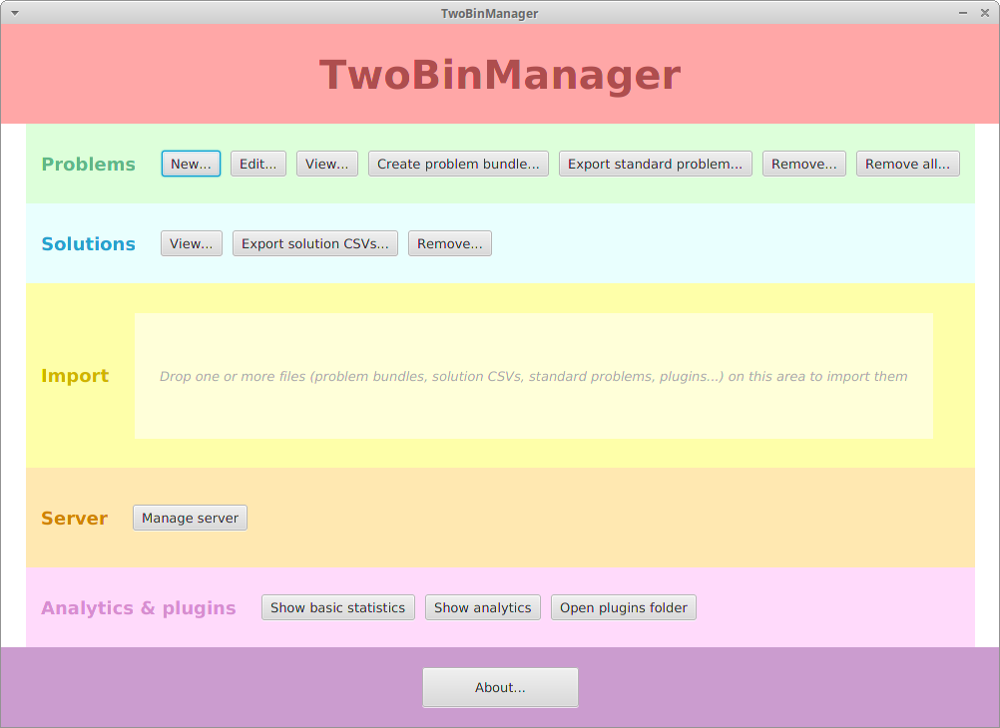
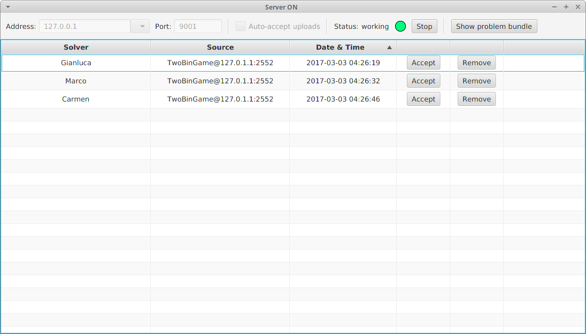
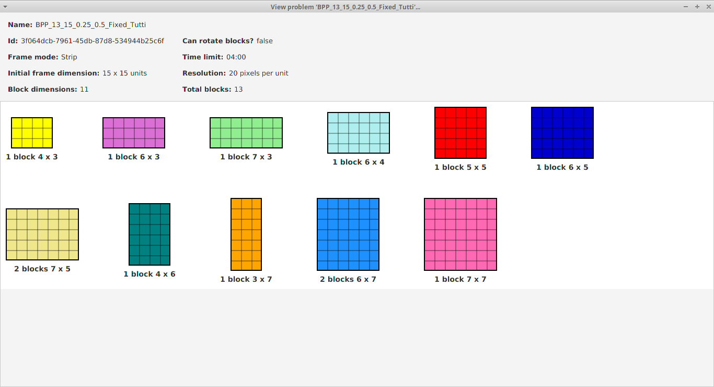
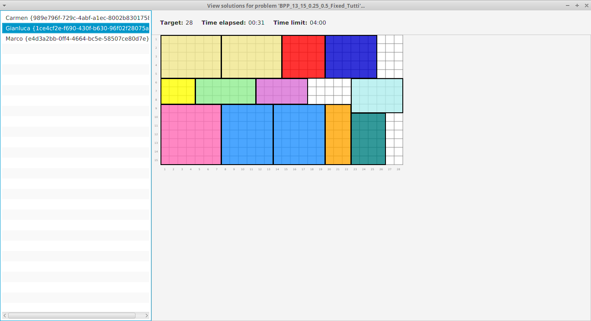

# TwoBinManager

*Management application for two-dimensional packing*

## Introduction

*TwoBinManager* is a visual application for managing two-dimensional problems and solutions; it is part of [TwoBinPack](https://github.com/giancosta86/TwoBinPack).

## Requirements

TwoBinManager requires Java 8 update 101 or later compatible version.

## Download and run

* The easier, suggested way to execute the app is via [MoonDeploy](https://github.com/giancosta86/moondeploy): just go to the [download area](https://github.com/giancosta86/TwoBinManager/releases/latest) and open *App.moondeploy* to automatically download and execute the application.

* Alternatively, the latest binary package can be downloaded [from GitHub](https://github.com/giancosta86/TwoBinManager/releases/latest): the executable script - for both Unix and Windows - is in the *bin* subdirectory.

In case of problems while starting up the application, please check your Java version and your [JAVA_HOME environment variable](http://docs.oracle.com/cd/E19182-01/820-7851/inst_cli_jdk_javahome_t/index.html): starting the program from the command line should also print out a detailed error description.

## Instructions

TwoBinManager is designed to be user-friendly and very intuitive; however, in case of doubts, please have a look at its [wiki](https://github.com/giancosta86/TwoBinManager/wiki).

## Screenshots

## Further references

* [TwoBinManager - SDK](https://github.com/giancosta86/TwoBinManager-sdk)

* [TwoBinGame](https://github.com/giancosta86/TwoBinGame)

* [TwoBinPack](https://github.com/giancosta86/TwoBinPack)

* [Facebook page](https://www.facebook.com/TwoBinPack-234021307010796)
